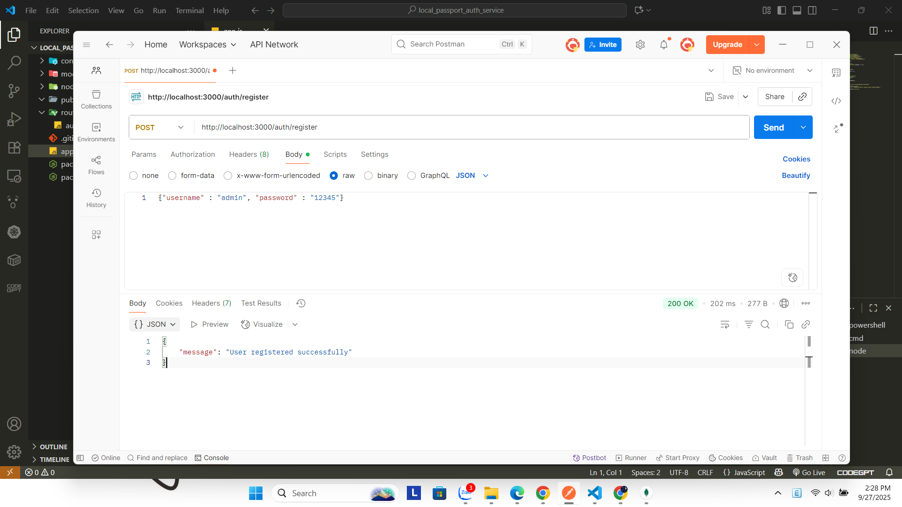
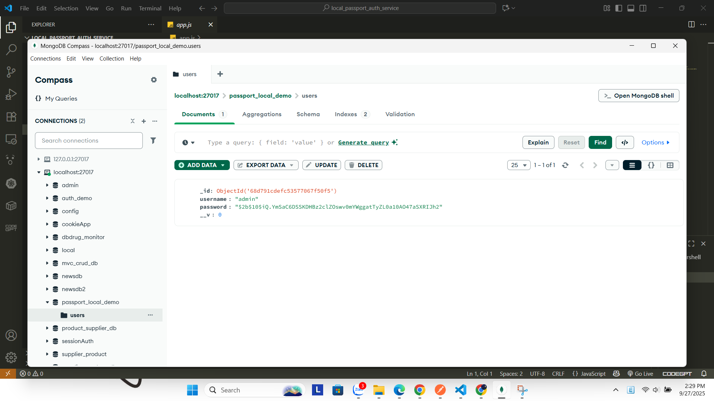
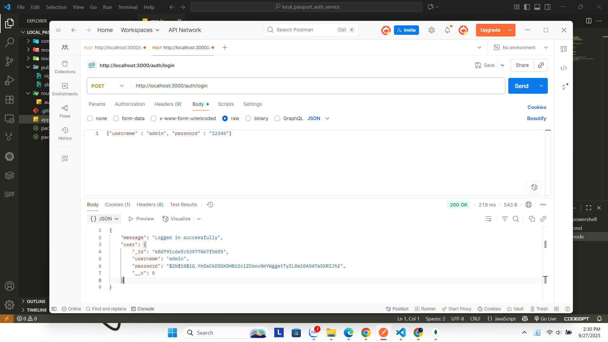
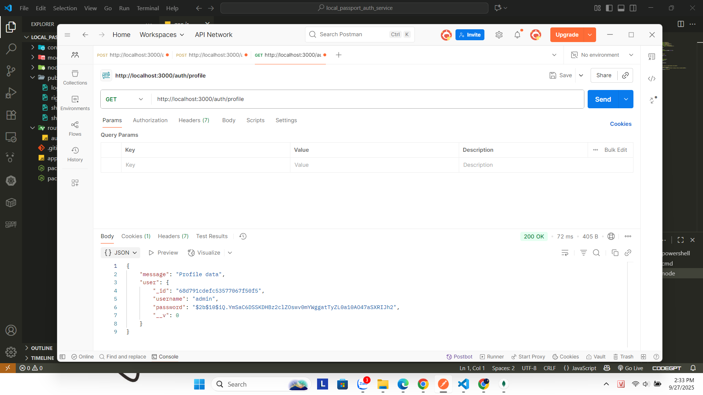
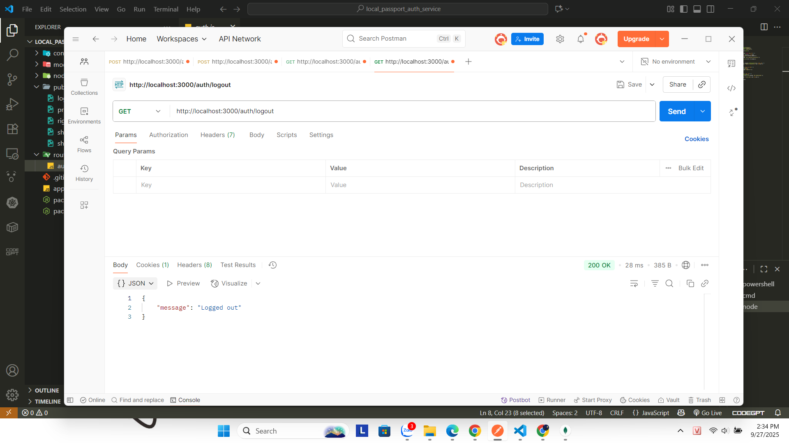

# Local Passport Auth Service

This project demonstrates **local authentication** using [Passport.js](http://www.passportjs.org/).  
Features included: **Register, Login, Protected Route (Profile), and Logout**.

---

## Test Results

### 1. Register
- API: `POST /register`
- Mô tả: Tạo user mới và lưu vào MongoDB.
- Kết quả:



#### Show users in MongoDB


---

### 2. Login
- API: `POST /login`
- Mô tả: Đăng nhập bằng Passport Local Strategy → tạo session và gửi cookie `connect.sid`.
- Kết quả:



#### Cookie sau khi login (Postman)


---

### 3. Profile (Protected Route)
- API: `GET /profile`
- Mô tả: Truy cập tài nguyên cần xác thực. Nếu chưa login → trả về `401 Unauthorized`.
- Kết quả:



---

### 4. Logout
- API: `GET /logout`
- Mô tả: Passport hủy session và xóa cookie.  
- Kết quả:



---

## How to Run

1. Cài đặt dependencies:
   ```bash
   npm install
2. Chạy server:
    ```bash
   node server.js
3. Server mặc định chạy tại:
      ```bash
  http://localhost:3000

